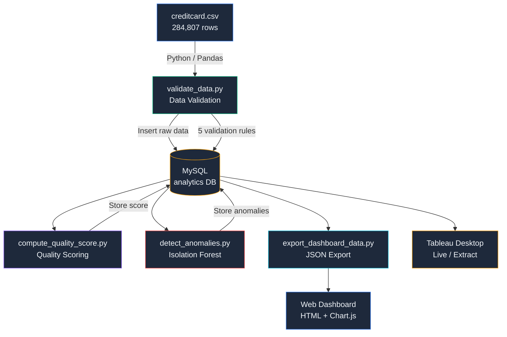
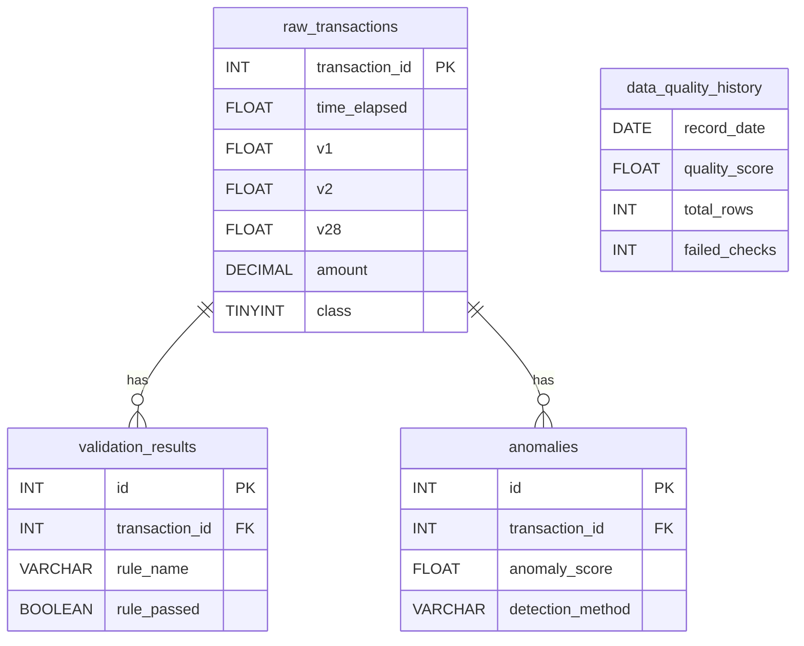
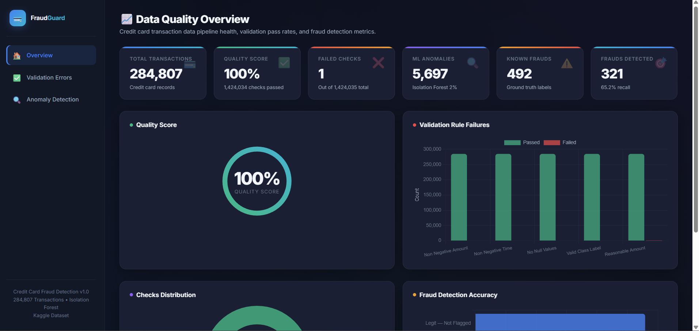
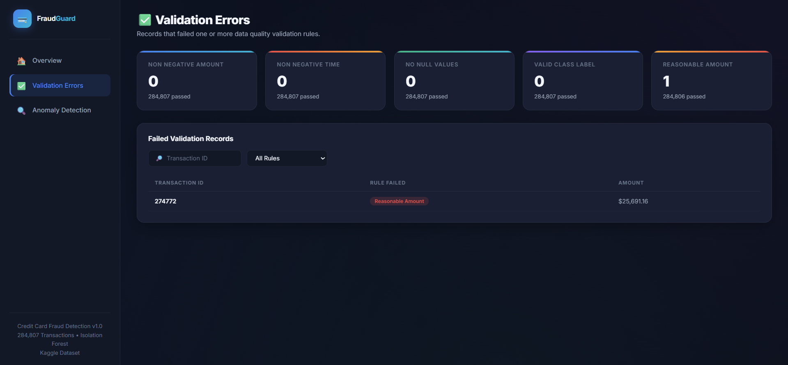
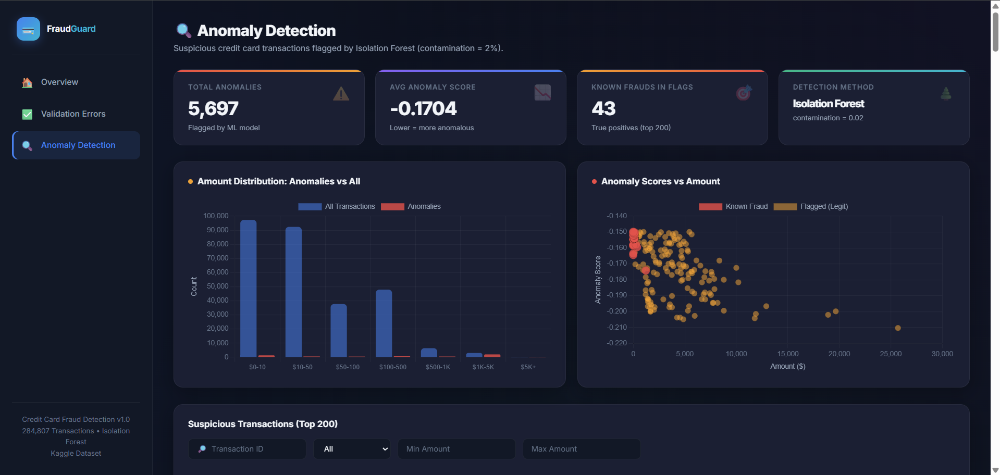
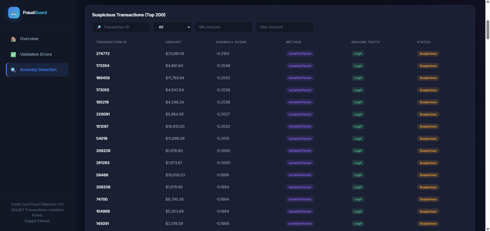
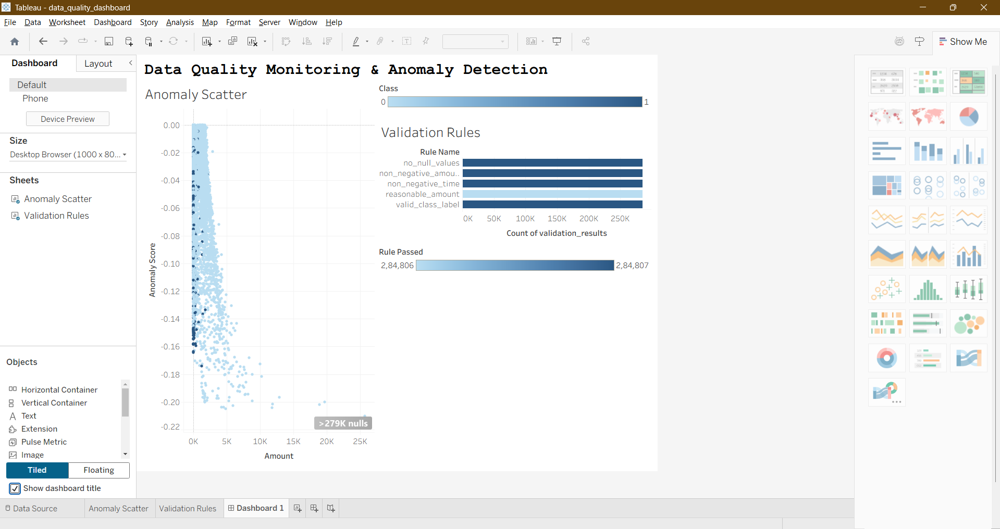

# Data Quality Monitoring & Anomaly Detection System

A data pipeline that ingests the [Kaggle Credit Card Fraud Detection](https://www.kaggle.com/datasets/mlg-ulb/creditcardfraud) dataset (284,807 transactions), validates data quality, detects anomalies using Isolation Forest, stores results in MySQL, and visualizes insights via an interactive web dashboard and Tableau.

---

## Architecture



---

## Tech Stack

| Layer | Technology |
|-------|-----------|
| Language | Python 3.13 |
| Data Processing | Pandas |
| ML Model | Scikit-learn (Isolation Forest) |
| Database | MySQL |
| ORM | SQLAlchemy + PyMySQL |
| Web Dashboard | HTML, CSS, Chart.js |
| BI Tool | Tableau Desktop |
| Notebook | Jupyter |

---

## Dataset

**Kaggle Credit Card Fraud Detection Dataset**

- **284,807** transactions over 2 days (September 2013)
- **31 columns**: `Time`, `V1`–`V28` (PCA-transformed features), `Amount`, `Class`
- **492 frauds** (0.17% of total — highly imbalanced)
- Features `V1`–`V28` are principal components from PCA (original features not provided for confidentiality)

---

## Folder Structure

```
data-quality-monitor/
├── DataSet/
│   └── creditcard.csv            # Kaggle dataset
├── sql/
│   └── create_tables.sql         # MySQL schema (4 tables)
├── scripts/
│   ├── config.py                 # DB connection settings
│   ├── validate_data.py          # Data validation (5 rules)
│   ├── compute_quality_score.py  # Quality score calculation
│   ├── detect_anomalies.py       # Isolation Forest anomaly detection
│   └── export_dashboard_data.py  # MySQL → JSON for dashboard
├── dashboard/
│   ├── index.html                # 3-page interactive web dashboard
│   └── data/                     # Exported JSON files
├── notebooks/
│   └── anomaly_detection.ipynb   # ML experimentation notebook
├── Pictures/                     # Dashboard screenshots
├── requirements.txt
└── README.md
```

---

## Database Schema



---

## Validation Rules

| # | Rule | Description |
|---|------|-------------|
| 1 | `non_negative_amount` | Transaction amount must be ≥ 0 |
| 2 | `non_negative_time` | Time elapsed must be ≥ 0 |
| 3 | `no_null_values` | No NULL/NaN in any column |
| 4 | `valid_class_label` | Class must be 0 or 1 |
| 5 | `reasonable_amount` | Amount must be ≤ $20,000 |

---

## Anomaly Detection

- **Algorithm**: Isolation Forest (Scikit-learn)
- **Features used**: `Amount`, `V1`–`V7`, `V14`, `V17`
- **Contamination**: 2%
- **Result**: 5,697 anomalies flagged out of 284,807 transactions

---

## Setup & Installation

### Prerequisites

- Python 3.x
- MySQL Server running locally
- Tableau Desktop (for Tableau dashboard)

### Steps

```bash
# 1. Install Python dependencies
pip install -r requirements.txt

# 2. Update MySQL password in scripts/config.py
# Default: root / 12345

# 3. Run the pipeline
python scripts/validate_data.py
python scripts/compute_quality_score.py
python scripts/detect_anomalies.py
python scripts/export_dashboard_data.py

# 4. Start the web dashboard
cd dashboard
python -m http.server 8080
# Open http://localhost:8080
```

---

## Dashboard Screenshots

### Web Dashboard — Overview
Quality score, validation rule pass rates, checks distribution, and fraud detection accuracy.



### Web Dashboard — Validation Errors
Records that failed validation rules. Only 1 record exceeded the $20K threshold.



### Web Dashboard — Anomaly Detection
Anomaly distribution by amount range, anomaly score scatter plot (fraud vs legitimate), and detection metrics.



### Web Dashboard — Suspicious Transactions Table
Top 200 suspicious transactions ranked by anomaly score, with ground truth labels and filtering.



### Tableau Dashboard
Anomaly scatter plot and validation rule bar chart connected live to MySQL.



---

## Pipeline Results

| Metric | Value |
|--------|-------|
| Total Transactions | 284,807 |
| Validation Checks Run | 1,424,035 |
| Failed Checks | 1 |
| Quality Score | 100.0% |
| ML Anomalies Flagged | 5,697 |
| Known Frauds (Ground Truth) | 492 |
